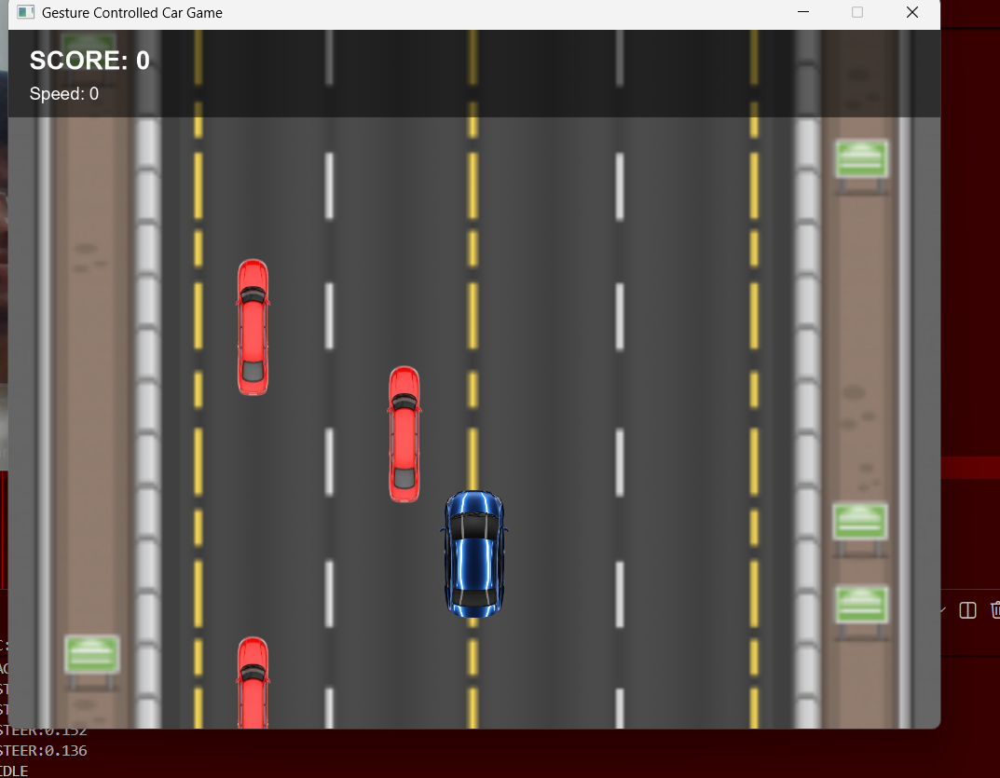

# 🚗 Gesture Controlled AI Car Game

A real-time highway driving game built using **JavaFX** and **Computer Vision**, where the player controls a car using hand gestures detected through a webcam.

This project combines **Artificial Intelligence**, **Computer Vision**, **Socket Programming**, and **Game Development** into a complete interactive system.

---

## 📸 Project Demo

src="">

> Replace the image above with your own gameplay screenshot or GIF.

---

## ✨ Features

### 🎮 Gameplay
- Smooth car movement
- Gesture-based steering
- Accelerate and brake using hand gestures
- Multiple enemy vehicles
- Collision detection
- Dynamic difficulty scaling
- Score tracking
- Restart system

### 🤖 AI Control
- Real-time webcam input
- Hand landmark detection
- Gesture recognition
- Live command transmission to game

### 🚦 Traffic System
- Random enemy spawning
- Multiple traffic lanes
- Increasing speed as score grows
- Fair collision hitboxes

### 🖥 User Interface
- Highway environment
- Custom vehicle sprites
- Live score display
- Speed indicator
- AI connection status
- Game Over screen

---

# 🏗 System Architecture

```text
┌─────────────────────┐
│      Webcam         │
└──────────┬──────────┘
           │
           ▼
┌─────────────────────┐
│ Python AI Module    │
│ OpenCV + MediaPipe  │
└──────────┬──────────┘
           │
     Socket Connection
           │
           ▼
┌─────────────────────┐
│ JavaFX Game Engine  │
└──────────┬──────────┘
           │
           ▼
┌─────────────────────┐
│   Car Racing Game   │
└─────────────────────┘
```

---

# 🧠 How It Works

### Step 1: Hand Detection
The Python AI module captures frames from the webcam and detects hand landmarks using MediaPipe.

### Step 2: Gesture Recognition
Hand position and gestures are converted into game commands:

| Gesture | Action |
|----------|---------|
| Move Hand Left | Move Car Left |
| Move Hand Right | Move Car Right |
| Open Palm | Accelerate |
| Closed Fist | Brake |

### Step 3: Communication
Commands are transmitted to the Java game through a TCP socket connection.

### Step 4: Game Engine
The JavaFX game receives commands and updates:

- Player movement
- Road animation
- Enemy traffic
- Collision detection
- Score system

---

# 🛠 Technologies Used

## Java

- Java 21
- JavaFX
- Maven
- AnimationTimer
- Socket Programming

## Python

- Python 3.x
- OpenCV
- MediaPipe
- NumPy
- Socket Library

---

# 📂 Project Structure

```text
gesture-car-game/
│
├── src/
│   ├── main/
│   │   ├── java/
│   │   │   └── com/gesturecargame/
│   │   │       ├── Main.java
│   │   │       ├── GameEngine.java
│   │   │       ├── Car.java
│   │   │       ├── EnemyCar.java
│   │   │       ├── Road.java
│   │   │       └── SocketReceiver.java
│   │   │
│   │   └── resources/
│   │       └── images/
│   │           ├── road.png
│   │           ├── car.png
│   │           └── enemy.png
│
├── python/
│   ├── sender.py
│   └── gesture_detector.py
│
└── pom.xml
```

---

# 🚀 Installation

## 1. Clone Repository

```bash
git clone https://github.com/yourusername/gesture-car-game.git
cd gesture-car-game
```

---

## 2. Install Python Dependencies

```bash
pip install opencv-python mediapipe numpy
```

---

## 3. Run Java Game

```bash
mvn clean javafx:run
```

---

## 4. Start AI Controller

Open a second terminal:

```bash
python sender.py
```

---

# 🎯 Gameplay Rules

- Avoid incoming traffic.
- Survive as long as possible.
- Score increases over time.
- Difficulty increases automatically.
- Collision ends the game.

---

# 📈 Skills Demonstrated

This project demonstrates practical experience with:

### Software Engineering
- Object-Oriented Programming
- Modular Design
- Event-Driven Architecture
- Real-Time Systems

### Artificial Intelligence
- Computer Vision
- Hand Tracking
- Gesture Recognition

### Networking
- TCP Socket Communication
- Cross-Language Integration

### Game Development
- Animation Loops
- Collision Detection
- Difficulty Scaling
- Sprite Rendering

---

# 🔥 Challenges Solved

- Integrating Python AI with JavaFX
- Real-time gesture control
- Maintaining smooth gameplay
- Synchronizing socket communication
- Building frame-rate independent movement
- Managing enemy spawning and collisions

---

# 📊 Performance

| Feature | Status |
|----------|---------|
| Gesture Control | ✅ |
| AI Detection | ✅ |
| Real-Time Communication | ✅ |
| Collision Detection | ✅ |
| Dynamic Difficulty | ✅ |
| Game Restart | ✅ |

---

# 🚀 Future Improvements

- Sound effects and music
- Multiple road themes
- Power-ups
- Leaderboards
- Better traffic AI
- Multiplayer mode
- Deep Learning gesture classification
- Mobile version

---

# 👨‍💻 Author

**MITANSH CHITLANGI**

Passionate about Artificial Intelligence, Computer Vision, and Software Engineering.

---

# ⭐ Why This Project Matters

Unlike traditional beginner projects, this application combines multiple domains:

- Artificial Intelligence
- Computer Vision
- Java Game Development
- Networking
- Real-Time Systems

The result is a fully interactive gesture-controlled game that demonstrates both software engineering and AI integration skills.

If you found this project interesting, consider giving it a ⭐ on GitHub.